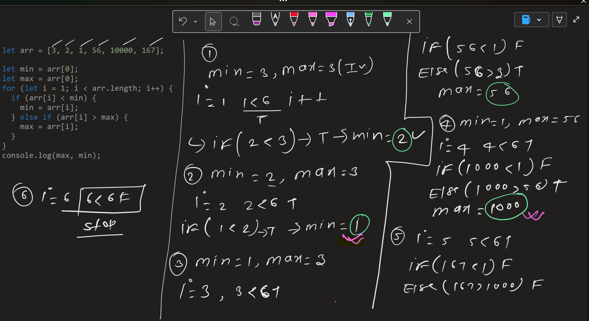

# Min and Max in Array

---

## Problem

Given an array `arr[]`. `Your task is to find the minimum and maximum elements in the array.`:

- the **minimum** element
- the **maximum** element

The array may contain one or more elements.

---

## Examples

### Example 1

Input: `[3, 2, 1, 56, 10000, 167]`
Output: ` 1 10000`

Explanation: `minimum and maximum elements of array are 1 and 10000.`

---

### Observations

- Both minimum and maximum can be identified in a single traversal
- Initializing from the first element avoids:
  - extra comparisons
  - incorrect defaults
- A single-element array is a valid boundary case

---

## Core Idea

- Maintain two variables while scanning the array:
- min → smallest value seen so far
- max → largest value seen so far
- Update them as needed while iterating.

---

### Visual Reasoning (Notes)

- Handwritten reasoning and dry runs were used to verify:
- how values evolve during traversal
- when updates occur for min and max
- (See images inside the notes/ folder.)

---

## Algorithm

```text
Initialize min = arr[0]
Initialize max = arr[0]

For each element from index 1 to end:
    If current element < min:
        update min
    Else if current element > max:
        update max


---

### Dry Run



---

### Implementation

See: `solution.js`
