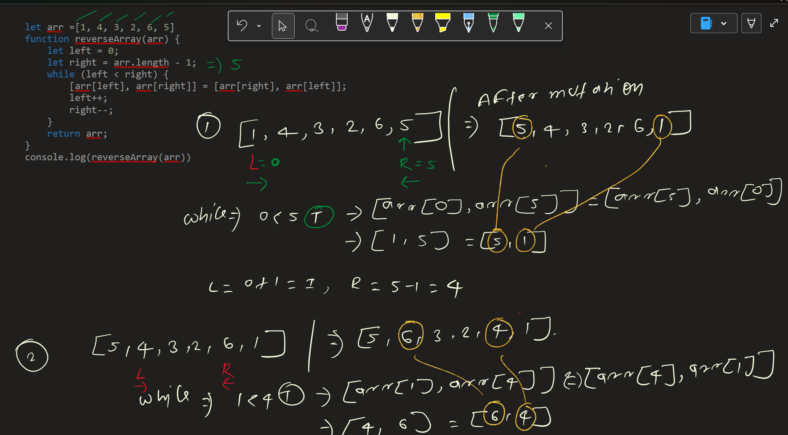
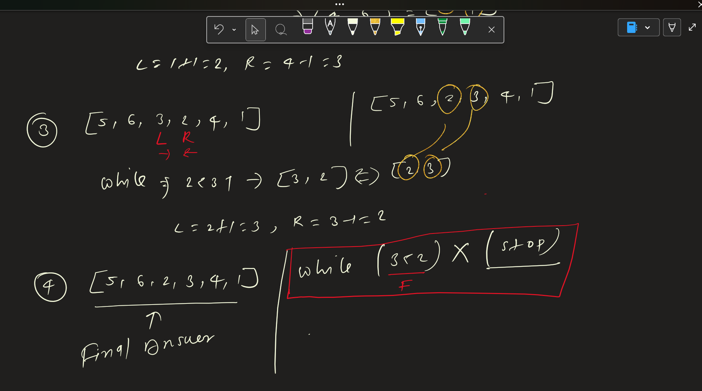

# Reverse Array

---

## Problem Statement

Given an array `arr[]`, reverse the array such that:
- The first element becomes the last
- The second element becomes the second last
- And so on

The reversal should rearrange elements symmetrically.

---

## Examples

Input: `[1, 4, 3, 2, 6, 5]`

Output: `[5, 6, 2, 3, 4, 1]`

---

## Initial Observation

- The element at index `i` moves to index `n - i - 1`
- Reversal is a **symmetric operation**
- Two general approaches exist:
  - Using extra space
  - In-place swapping

---

## Visual Reasoning (OneNote)

### Basic Intuition

- First ↔ Last
- Second ↔ Second Last
- Continue until the middle

---

### Dry Run

- Track index mapping:
  - `0 ↔ n-1`
  - `1 ↔ n-2`
  - …

---

---

## Approach 1: Using Extra Space

### Idea

Create a temporary array and copy elements from the original array in reverse order.

---

---

## Approach 2: In-Place Swapping

### Idea

Swap elements from both ends moving towards the center.

- Swap `arr[left]` and `arr[right]`
- Increment `left`, decrement `right`
- Stop when `left >= right`

### Complexity Analysis

- Time Complexity: O(n)
- Space Complexity: O(1)

### Implementation

See: `solution-inplace.js`

