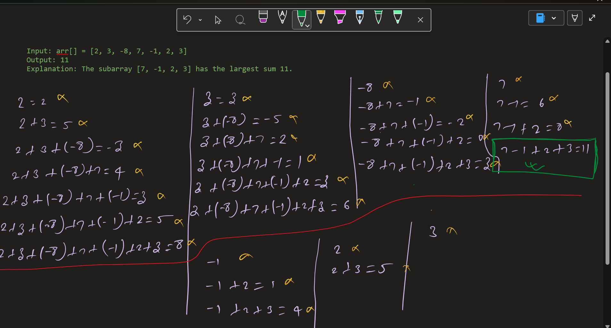

# Kadane’s Algorithm – Maximum Subarray Sum

---

## Problem Statement

You are given an integer array `arr[]`.  
Your task is to find the **maximum sum of a contiguous subarray** (containing at least one element).

> A subarray is a continuous part of an array.

---

## Examples

### Example 1

**Input:**  
`[2, 3, -8, 7, -1, 2, 3]`

**Output:**  
`11`

**Explanation:**  
The subarray `[7, -1, 2, 3]` has the largest sum = `11`.

---

### Example 2

**Input:**  
`[-2, -4]`

**Output:**  
`-2`

**Explanation:**  
All elements are negative, so the maximum subarray is the single largest element `-2`.

---

## Initial Observations

- Subarray must be **contiguous**
- Brute force approach checks all subarrays → **O(n²)** (inefficient)
- We need an **optimized linear solution**
- Negative sums reduce future potential → should be discarded early

---

## Core Insight (Key Brain Logic)

At every index, we face a decision:

> **Should I continue the previous subarray OR start a new one?**

This leads to the fundamental Kadane choice:


---

## Visual Reasoning (OneNote)

### Basic Intuition

- If current running sum becomes **negative**, it is useless for future elements
- Start fresh from the next element
- Track the **best sum seen so far**

---

### Dry Run Example




Tracking two variables:
- `currSum` → sum ending at current index
- `maxSoFar` → global maximum

---

## Algorithm (Kadane’s Algorithm)


---

## Why This Works

- We only care about subarrays that **increase future sum**
- Negative prefix sums are discarded
- Guarantees optimal result in one pass

---
### Implementation

See: `solution.js`
---

## Implementation (JavaScript)

```js
let arr = [2, 3, -8, 7, -1, 2, 3];

let maxSoFar = arr[0];  // Overall maximum
let currSum = arr[0];   // Current subarray sum

for (let i = 1; i < arr.length; i++) {
    currSum = Math.max(arr[i], currSum + arr[i]);
    maxSoFar = Math.max(maxSoFar, currSum);
}

console.log(maxSoFar); // 11

