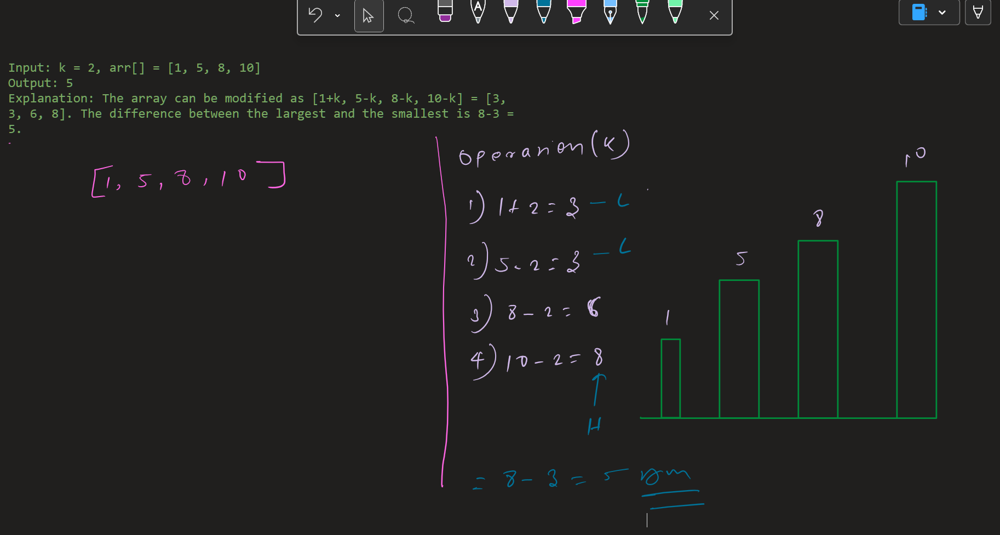

# Minimize the Heights II

---

## Problem Statement

Given an array `arr[]` representing heights of towers and a positive integer `k`.

For each tower, **exactly one operation must be performed**:

- Increase its height by `k`, or
- Decrease its height by `k`

After modification:

- Heights must be **non-negative**
- Minimize the difference between the **tallest** and **shortest** towers

---

## Examples

### Example 1

Input:
`arr = [1, 5, 8, 10], k = 2`

Output:
`5`

Explanation:
Modified heights → `[3, 3, 6, 8]`  
Difference → `8 - 3 = 5`

---

### Example 2

Input:
`arr = [3, 9, 12, 16, 20], k = 3`

Output:
`11`

Explanation:
Modified heights → `[6, 12, 9, 13, 17]`  
Difference → `17 - 6 = 11`

---

## Initial Observations

- Every element must be modified exactly once
- After sorting, only **boundary values matter**
- Internal ordering does not affect min–max difference
- Naive brute force is exponential

---

## Core Insight

After sorting:

- Small elements should be increased
- Large elements should be decreased

The challenge is deciding **where to split** the array.

---

## Greedy Strategy

1. Sort the array
2. Assume:
   - First part → increased by `k`
   - Second part → decreased by `k`
3. Try all valid split points
4. Compute min and max after each split
5. Track the minimum difference

---

## Visual Reasoning (OneNote)

---

### Split Point Analysis



Each split represents:

- Left side → `+k`
- Right side → `-k`

---

## Algorithm

```js
Sort the array
Initialize answer = max(arr) - min(arr)

Set:
smallest = arr[0] + k
largest = arr[n-1] - k

For each index i from 0 to n-2:
minVal = min(smallest, arr[i+1] - k)
maxVal = max(largest, arr[i] + k)
```
